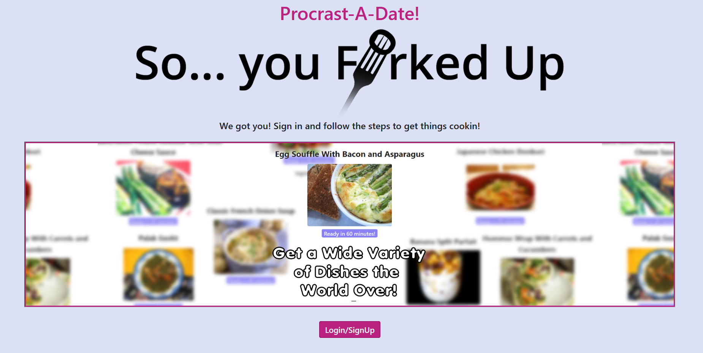
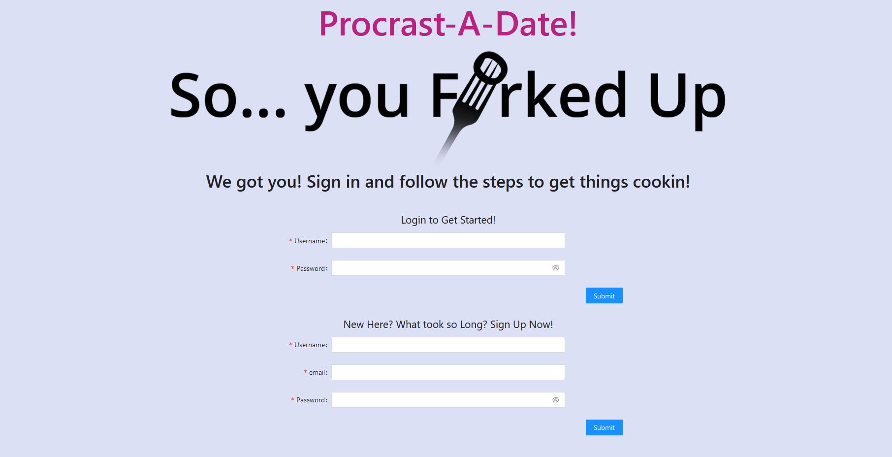
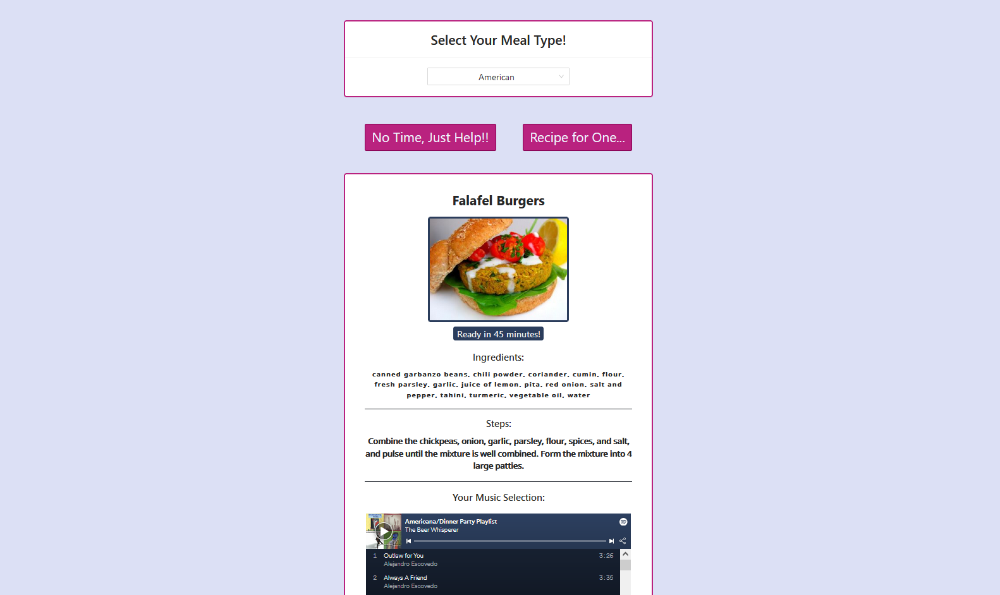

# Procrast-A-Date

## Description 

Our app caters to the last minute preparations for a date that everyone will run into. With that in mind we built this MERN SPA application that generates a random recipe based on user input and likewsie returns an appropriate Spotify platlist that relates to the  cusine selected.

## Table of Contents 

 [Contributors](#contributors)
 [Languages](#languages)
 [License](#license)
 [Documentation](#documentation)

## Contributors

[Taylor Black](https://github.com/TWFB29)
[Logan Dufek](https://github.com/LoganDufek)
[Mariah Eckrich](https://github.com/meck512)
[Daniel Martinez](https://github.com/DanM1996)
[Kevin Myers](https://github.com/KevinPMyers)

## Tools Used

* HTML
* CSS
* JavaScript
* 3rd Party APIs (Spoonacular, Spotify)
* Node.js
* Express.js
* NoSQL(MongoDB)
* Mongoose
* JSONWebToken
* bcrypt
* React
* Ant Design
* JSX
* Apollo
* GraphQL

### Our App's Functionality

Our project is a full stack MERN application: we've utilized custom-made CSS paired with Ant Design for a polished front end while using industry standard technology (React, MongoDB) for a robust backend, along with an alternative to REST APIs in the form of GraphQL powered by Apollo. You can sign up and log in to your personal account and access various recipes and songs provided by Spoonacular and Spotify APIs.

## License

MIT License

Permission is hereby granted, free of charge, to any person obtaining a copy
of this software and associated documentation files (the "Software"), to deal
in the Software without restriction, including without limitation the rights
to use, copy, modify, merge, publish, distribute, sublicense, and/or sell
copies of the Software, and to permit persons to whom the Software is
furnished to do so, subject to the following conditions:

The above copyright notice and this permission notice shall be included in all
copies or substantial portions of the Software.

THE SOFTWARE IS PROVIDED "AS IS", WITHOUT WARRANTY OF ANY KIND, EXPRESS OR
IMPLIED, INCLUDING BUT NOT LIMITED TO THE WARRANTIES OF MERCHANTABILITY,
FITNESS FOR A PARTICULAR PURPOSE AND NONINFRINGEMENT. IN NO EVENT SHALL THE
AUTHORS OR COPYRIGHT HOLDERS BE LIABLE FOR ANY CLAIM, DAMAGES OR OTHER
LIABILITY, WHETHER IN AN ACTION OF CONTRACT, TORT OR OTHERWISE, ARISING FROM,
OUT OF OR IN CONNECTION WITH THE SOFTWARE OR THE USE OR OTHER DEALINGS IN THE
SOFTWARE.

## Documentation

Live Deployed Application (Heroku): 

Here is a look at our application! 

This is the landing page you will see if you aren't logged in or signed up.

Here is a look at the login/signup page.

Once you're signed in, you will be able to select a recipe by cusine and get back a Spotify playlist to match your choice of food.

Presentation Link:
https://docs.google.com/presentation/d/1LSfwPnX9z6vsILPbMRV2R8mu5uy-Q4F9qr_QrpsMZaM/edit?usp=sharing 
